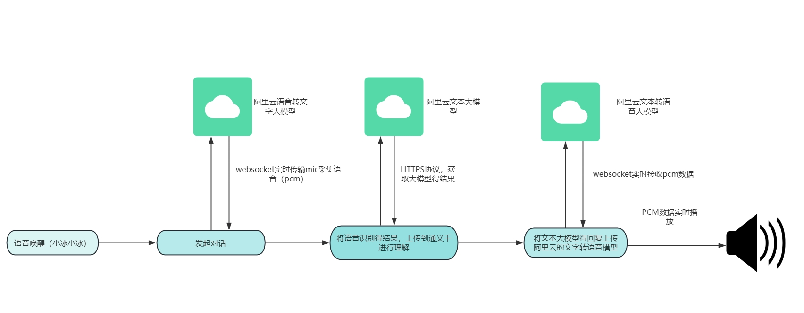
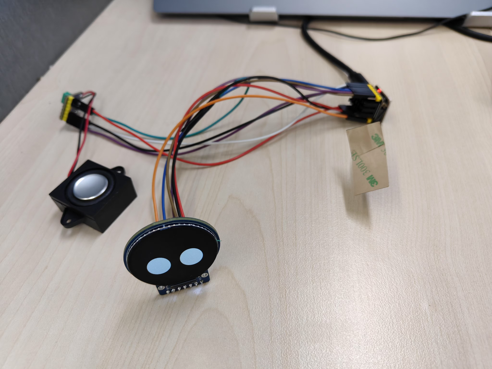

# **Smart-Robot** #

## 项目介绍 ##

本项目ESP-IDF框架实现接入阿里云百炼大模型平台，实现语音词唤醒，智能语音问答。项目硬件主控芯片ESP32S3，扬声器MAX98357A，屏幕TFT 分辨率240*240 GC9A01

## 项目整体流程图 ##

## 源码文件树 ##

Smart-Robot
│  CMakeLists.txt
│  dependencies.lock
│  README.md
│  sdkconfig
│  sdkconfig.old
│  
├─components
│  └─dev_bsp //驱动文件
│          CMakeLists.txt
│          esp32s3_bsp_board.c
│          esp32s3_bsp_board.h
│          esp32s3_bsp_camera.c    
│          esp32s3_bsp_display.c
│          esp32s3_bsp_mic.c
│          esp32s3_bsp_sdcard.c
│          esp32s3_bsp_speaker.c
│          
├─main
│  │  CMakeLists.txt
│  │  idf_component.yml
│  │  main.c
│  │  
│  ├─app  //应用层程序
│  │      app_audio.c
│  │      app_audio.h
│  │      app_chat.c
│  │      app_chat.h
│  │      app_network.c
│  │      app_network.h
│  │      app_sr.c
│  │      app_sr.h
│  │      app_tts.c
│  │      app_tts.h
│  │      conf.h
│  │      data_handle.c
│  │      data_handle.h
│  │      esp_websocket_client.c
│  │      esp_websocket_client.h
│  │      
│  └─ui
│          app_display.c
│          app_display.h
│          
└─pic
        流程图.png

## SD卡文件树 ##

设备的flash有限，故语音唤醒模型 音频文件 屏幕显示emoji表情存放在SD卡中
├─fst
│      commands_cn.txt
│      commands_en.txt
│      
├─mn6_cn
│      mn6_data
│      mn6_index
│      vocab
│      _MODEL_INFO_
│      
├─wn9_xiaobinxiaobin_tts
│      wn9_data
│      wn9_index
│      _MODEL_INFO_
│      
├─audio
│      echo_cn_wake.pcm
│      echo_end.pcm
│      aa.pcm
│      o.pcm
│      
├─tts
│      esp_tts_voice_data_xiaoxin_small.dat
│      
└─emoji
     
 ## GC9A01 RGB565显示转换脚本##

oneFrame.py 可以转换单张图片
numsFrame.py 可以批量转换多张图片，可以将一段视频使用ffmpeg拆分成多帧连续的图片，然后使用脚本转换成RGB565格式用于TFT屏幕显示

 ## 项目接线成品图##

## 快速开始 ##

1.登录阿里云百炼平台申请大模型的API-KEY
2.进入项目smart-robot\main\app\conf.h 配置wifi的SSID及密码 以及申请的API-KEY即可开始验证
3.项目中的语音识别模型基于ESP-SR的开源模型，可以通过idf.py menuconfig  修改唤醒词
4.需要将项目中的sdcard目录复制到TF中根目录中

## 待优化 ##

1.本项目目前只支持单轮智能问答，后续会支持多轮问答
2.本项目的TFT显示目前有些许的卡顿，正在优化中
3.项目中还有很多未知的bug，还望诸君不吝赐教 感谢

## 鸣谢 ##

项目中使用的emoji表情来源于稚辉君ElectronBot项目感谢

